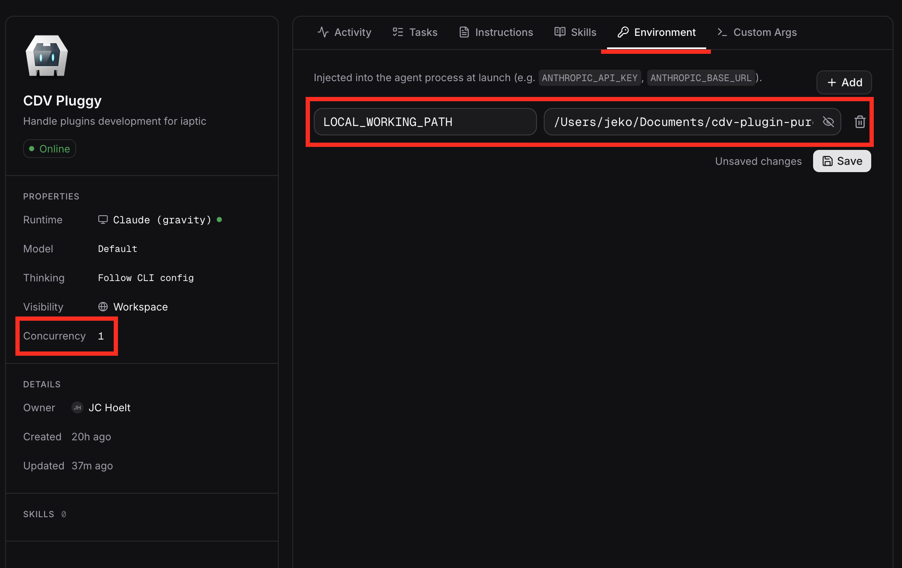

# multica-local-workdir

Thin shell wrappers that let [multica](https://multica.ai/) agents work directly inside your local project directory — so project-scoped skills, slash commands, MCP servers, and settings actually load — without patching multica itself.

## The problem

multica creates a per-session **workspace directory** (e.g. `~/multica_workspaces/<uuid>/.../workdir`) and runs the agent CLI from there. As a result:

1. **Project-scoped configuration isn't loaded.** Skills, slash commands, subagents, MCP servers, settings, hooks — everything that lives under `<project>/.claude/` or `<project>/.opencode/` — is keyed strictly off the agent's CWD. Running from the workspace means none of it loads.
2. **The workspace's instructions file is the only one that loads.** multica writes a `CLAUDE.md` (or `AGENTS.md`) into the workspace with agent-specific behaviour instructions. If you `cd` into the project to fix #1, you lose those.
3. Dev agents working on large monorepos or heavy setup projects need to go fresh for every session.

These wrappers fix those: they `cd` into the project so project-scoped config loads, then re-inject the workspace's instructions file into the agent's system prompt.

## Install

```bash
git clone https://github.com/j3k0/multica-local-workdir.git
cd multica-local-workdir
cp .env.example .env   # then edit — set MULTICA_SERVER_URL
./multica-daemon
```

## Telling the wrapper which project to use

Set `LOCAL_WORKING_PATH=/abs/path/to/project` in the environment multica launches agents under. (Alternatively, append `--working-directory <path>` to the agent's extra args in multica's per-agent configuration.)

## Set agent concurrency to 1

In each agent's multica configuration, set `concurrency: 1`. Two sessions of the same agent running concurrently would share the same project directory — lock files, git state, and edits would step on each other.

## Example agent configuration



## Allowing project MCP servers (claude)

multica injects `--strict-mcp-config` into the `claude` CLI, which makes claude ignore any MCP servers configured in the project (`.claude/settings.json`) or in the user's claude config. That's a sensible default for multica's hosted SaaS, but on a self-hosted setup the operator owns the project and usually wants those servers to load (see [multica#2532](https://github.com/multica-ai/multica/issues/2532)).

Set `LWD_ALLOW_MCP=1` in `.env` (or per-agent in multica) and the `claude` wrapper strips the flag before exec'ing the CLI. Default is off — only opt in if you trust every MCP server the project can reach. The env var can also be set per agent in multica.

## Routing claude through a different provider

Set `LWD_PROVIDER=<name>` and the `claude` wrapper sources `claude-providers/<name>.sh` before exec'ing the CLI. The provider file is just a bash file that exports `ANTHROPIC_BASE_URL`, `ANTHROPIC_AUTH_TOKEN`, model defaults, etc. — claude itself does the rest.

Two providers ship as examples:

- **`deepseek`** — DeepSeek's Anthropic-compatible API. Requires `DEEPSEEK_API_KEY` in `.env`.
- **`ollama`** — local Ollama daemon. Use any model the daemon can run (e.g. self-hosted `qwen3.6:35b`), or an Ollama Cloud model like `glm-5.1:cloud` (requires `ollama signin`). No separate key in either case.

Add your own by dropping a `claude-providers/<name>.sh` file alongside them. Provider files may honour `LWD_MODEL` to let you switch models without editing the file. Set `LWD_PROVIDER` and `LWD_MODEL` in `.env` as project defaults; values already in the environment (e.g. set per-agent in multica) take precedence.

Unknown provider names fail loud rather than silently falling back to Anthropic (which would burn real credits on a typo).
